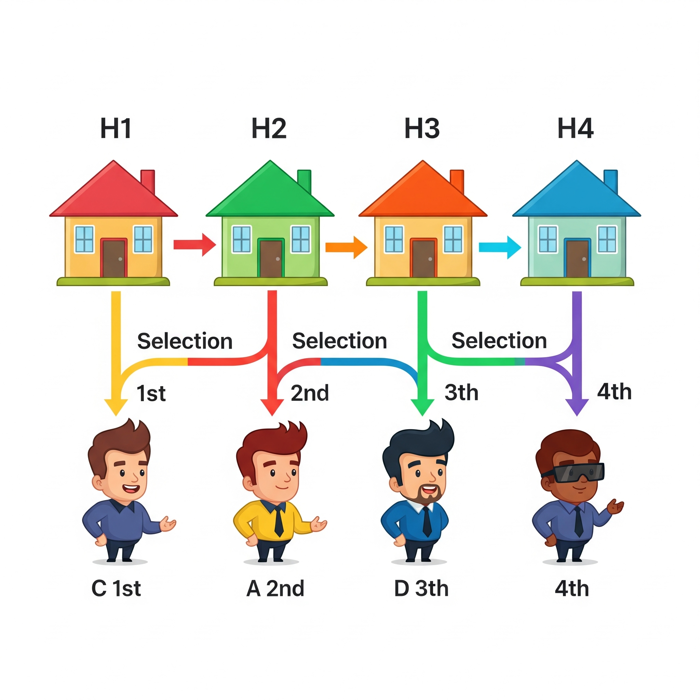
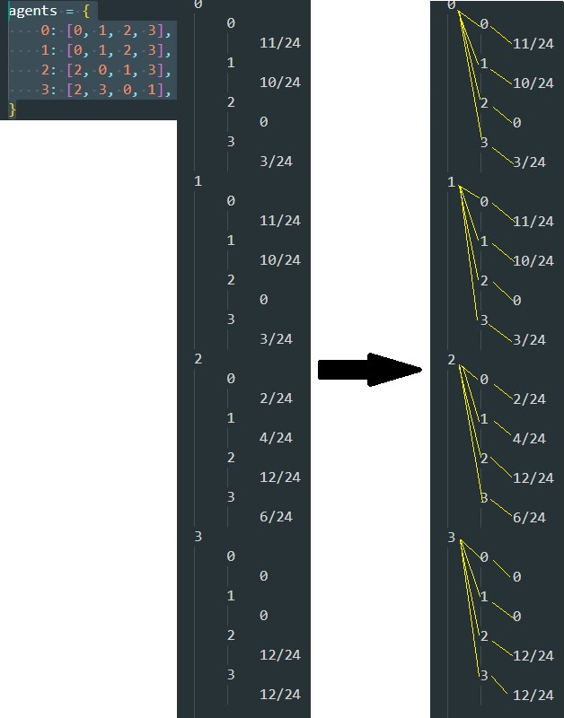
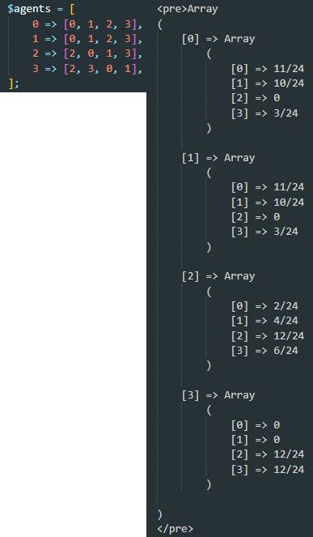

## 🧮 Random Serial Dictatorship (RSD) Algorithm

Welcome! This repository implements the **Random Serial Dictatorship (RSD)** algorithm for resource allocation problems.

### Applications

The Random Serial Dictatorship (RSD) algorithm has various scientific and practical applications, including:

- **Assigning dormitories:** Used for assigning dormitories to students in universities.
- **School choice systems:** Applied in school choice systems to allocate students to schools.
- **Economics:** Utilized in economic models for allocating limited resources fairly.

This algorithm’s simplicity and fairness make it a valuable tool in resource allocation problems.

### 📌 About the Project

This project contains **two versions** of the RSD algorithm:

* **Python version**
* **PHP version**

You can specify the input data at the top of each code file using the `agents` variable. This variable maps each agent (by index) to their **ranked preferences** of goods or services.

### ✅ Input Format

* The number of agents must be **greater than 1**.
* Each agent’s preferences must:

  * Include **non-duplicate items**
  * Be equal in length to the number of agents

**Example input definition** (as comments at the top of the file):

```python
# agents = {
#   0: [2, 1, 0],
#   1: [0, 2, 1],
#   2: [1, 0, 2]
# }
```

### 📤 Output Format

The output of the algorithm is:

* In **Python**: a dictionary → `agent_index => allocation_probability`
* In **PHP**: an associative array → `agent_index => allocation_probability`

### 💡 IDE Recommendation

We recommend using **Visual Studio Code** with the **Code Runner** extension:

* Easy variable editing
* Quick output view

### 🎨 Visualization of RSD

Below is a illustration about the RSD algorithm working. Four agents select their preferred houses in a randomly assigned order, with arrows indicating allocations, showing each agent’s choice from the available options in a non-reversible process.:



### 🧪 Input & Output Sample

Python Version: 

PHP Version: 

### 👨‍💻 Credits

This project was created and developed by **Mohammad Amin Mashayekhan**.
Special thanks to:

* Assistant Professor **Mehdi Feizi**
* [Stack Overflow](https://stackoverflow.com)
* [php2python.com](https://www.php2python.com)
* And other online resources

### 📬 Contact

If you have any questions, feedback, or would like to discuss this project further, feel free to get in touch:

- 📧 Email: [amin.mashayekhan@gmail.com](mailto:amin.mashayekhan@gmail.com)
- 📅 Schedule a quick tech call: [Book a 15-minute meeting](https://calendly.com/amin-mashayekhan/15min-tech-call)

---

Thank you for visiting this repository!
